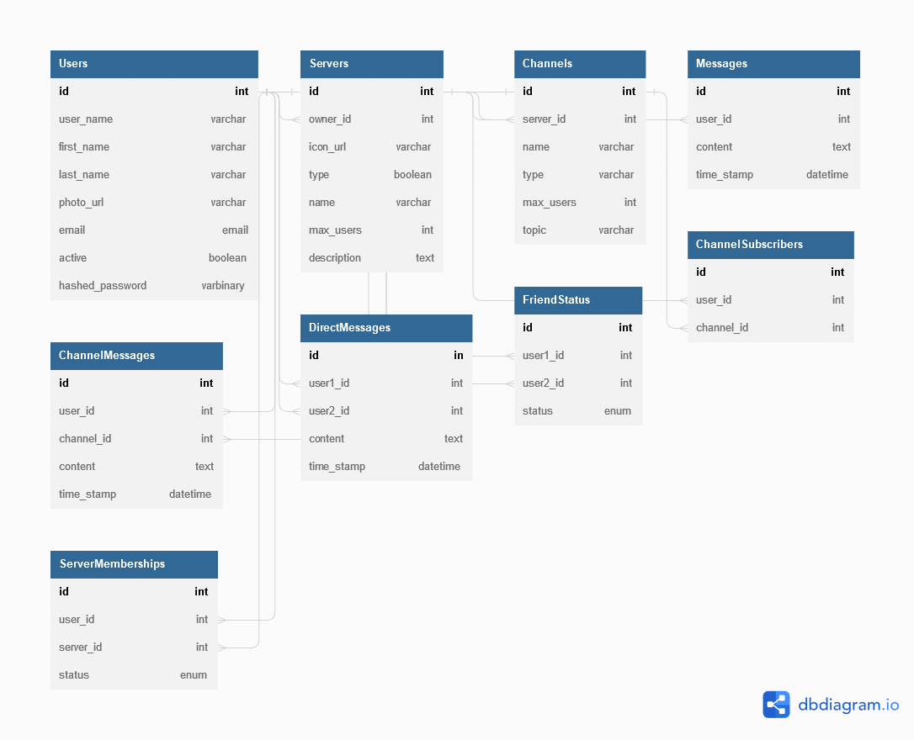

# Discord

## Database Schema


## Four CRUD


## Servers
* CREATE SERVER
* DELETE SERVER
* READ SERVER
* UPDATE SERVER

### Channels
* CREATE CHANNEL
* DELETE CHANNEL
* READ CHANNEL
* UPDATE CHANNEL

### Live Chat
* POST MESSAGES
* READ MESSAGES

### Direct Messaging
* POST MESSAGE
* READ MESSAGE

<!-- MAYBE -->
### Friends
* ADD FRIEND
* DELETE FRIEND


### Redux Store Tree
```
store = {
  session: {
    user: {
      userData
    },
    memberships: [ userId list ],
    friends: [ userId list ]
  },
  servers: {
    allServers: {
      [serverId]: {
        serverData,
        Channels: {
          allChannels: {
            [channelId]: {
              channelData
            }
          }
        }
        Members: {
          allUsers: {
            [userId]: {
              userData
            }
          }
        },
        Host: {
          userData
        },
        AllCategories: [ categories list ]
      }
    },
    singleServer: {
      serverId
    }
  },
  channels: {
    allChannels: {
      [channelId]: {
        channelData,
        Messages: {
          [messages_id]: {
            messageData
          }
        },
        HostServer: {
          serverData
        },
        Subscribers: [ userId list ]
      }
    },
    singleChannel: {
      channelId
    }
  }
}

```
